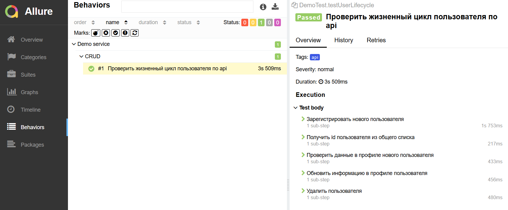

# Пример api-теста на Java
[](https://adoptium.net/)
[](https://maven.apache.org/)
[](https://junit.org/junit5/)
[](https://rest-assured.io/)
[](https://allurereport.org/)

## Демо проекта по автоматизированному тестированию REST API на Java.
Небольшой пример написания api-теста в демонстрационных целях, который включает в себя:
* **Сервисный слой** (`UserService`) для бизнес-логики
* **Модели данных** на основе наследования (`AbsUser` → `User`)
* **Изолированные тесты** на JUnit 5 с генерацией уникальных данных через **JavaFaker**
* **Полный CRUD-сценарий** жизненного цикла пользователя: регистрация → чтение → обновление → удаление

## Технологический стек
- **Java 25** — язык программирования
- **Maven 3.9.10** — управление зависимостями и сборка
- **JUnit 5.10.2** — тестовый фреймворк
- **JavaFaker** — генерация реалистичных тестовых данных
- **Rest Assured 6.0.1** — HTTP-клиент для API-запросов
- **JSON Path** — извлечение данных из json
- **Allure 2.35.4** — система отчетности
- **SLF4J + Logback** — логирование запросов и ошибок

## Запуск api-тестов
```bash
# Запуск теста
mvn clean test -Dtest=DemoTest#testUserLifecycle

# Генерация и открытие Allure отчёта
mvn allure:serve
```
## Отчёт:
